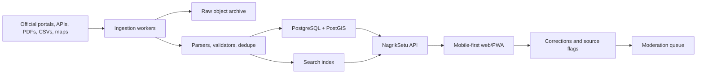

# Architecture

## Draft 3 Checkpoint 3

Draft 3 checkpoint 3 is a Next.js full-stack app with a deterministic local data backbone, first-party civic detail pages, geographic navigation, sourced state/UT profiles, and pilot-ready citizen feedback path:

- `src/app/page.tsx` renders the primary search workspace.
- `src/app/api/search/route.ts` serves typed search results.
- `src/app/api/sources/route.ts` returns source catalog and health.
- `src/app/api/ingestion/route.ts` returns ingestion report metadata.
- `src/app/api/feedback/route.ts` validates correction feedback and writes local moderation queue artifacts.
- `src/lib/seed-data.ts` stores deterministic base records that the Draft 2 ingestion demo normalizes with generated source records.
- `src/lib/corrections.ts` owns correction validation, ids, and persistence boundaries.
- `src/ingestion` defines source catalog, adapter contracts, validation, and source-health checks.
- `src/data/repository.ts` gives the app one read path for records and ingestion state.
- `src/lib/search.ts` provides deterministic local ranking.
- `src/lib/i18n.ts` provides the pilot English/Hindi interface copy.
- `src/app/records/[id]` renders first-party detail pages for every normalized record.
- `src/app/places/[...slug]` renders typed country, state/UT, district, city, local-body, ward, and locality pages from `src/data/geography.ts`.
- `src/data/state-profiles.ts` supplies one provenance-aware administration and economic profile for each of the 36 state/UT pages.
- `src/app/directory` and `src/app/sitemap.ts` provide human and machine route indexes.
- `public/sw.js`, `public/offline.html`, and `src/app/manifest.ts` provide PWA install and offline fallback basics.

## Target System

## Design Choices

- Start with typed in-repo data to prove the UX and contracts.
- Keep provenance attached to each record from the first draft.
- Use a map component only on the client so server rendering stays reliable.
- Keep API responses cacheable for low-bandwidth usage.
- Keep local correction artifacts out of source control while preserving a queue directory for development.
- Model administrative and local-government geography as overlapping branches with explicit related-region links.
- Generate top-level pages for all 28 states and 8 Union Territories while leaving unpopulated lower-level records visibly under development.
