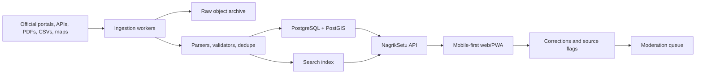

# Architecture

## Draft 2

Draft 2 is a Next.js full-stack app with a deterministic local data backbone:

- `src/app/page.tsx` renders the primary search workspace.
- `src/app/api/search/route.ts` serves typed search results.
- `src/app/api/sources/route.ts` returns source catalog and health.
- `src/app/api/ingestion/route.ts` returns ingestion report metadata.
- `src/app/api/feedback/route.ts` accepts correction feedback as a stub.
- `src/lib/seed-data.ts` stores deterministic base records that the Draft 2 ingestion demo normalizes with generated source records.
- `src/ingestion` defines source catalog, adapter contracts, validation, and source-health checks.
- `src/data/repository.ts` gives the app one read path for records and ingestion state.
- `src/lib/search.ts` provides deterministic local ranking.

## Target System

## Design Choices

- Start with typed in-repo data to prove the UX and contracts.
- Keep provenance attached to each record from the first draft.
- Use a map component only on the client so server rendering stays reliable.
- Keep API responses cacheable for low-bandwidth usage.
