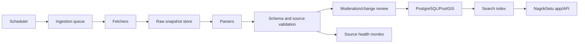

# Automated Ingestion Plan

## Operating Principle

Automation should behave like a careful public-record clerk:

- Prefer official APIs, bulk downloads, and published files.
- Archive raw metadata before normalization.
- Validate every normalized record before it reaches search.
- Store source URL, source name, last checked date, license note, confidence, and extraction warnings.
- Route users to official portals; do not submit forms for them.
- Stop or fall back to link-only mode when a source requires login, captcha, paywall access, or hostile scraping.

## Connector Tiers

### Tier 1: Bulk/API Connectors

Use for LGD, data.gov.in, public CSV/XLSX/PDF reports, and any official dataset with stable download URLs.

Pipeline:

1. Discover dataset or report URL.
2. Fetch with rate limits and conditional requests where supported.
3. Store raw file plus metadata in `data/raw` locally and object storage in production.
4. Parse with a structured parser.
5. Normalize to `NagrikRecord` plus geography mappings.
6. Run validation and dedupe.
7. Send changes to moderation when confidence is below high or facts conflict.

Recommended tools:

- Node fetch/undici for APIs and downloads.
- `xlsx` or SheetJS-compatible parser for spreadsheets.
- `pdfplumber`/Poppler for source PDFs when table extraction is needed.
- PostgreSQL/PostGIS for persistence and spatial lookups.

### Tier 2: Public HTML Table Connectors

Use for official pages with public tables, directories, and notices.

Pipeline:

1. Check robots.txt and source terms.
2. Fetch static HTML.
3. Parse with Cheerio-like DOM extraction.
4. Store source snippet, fetch time, and selector version.
5. Validate and flag layout changes.

Recommended tools:

- Cheerio for static HTML.
- Playwright only for public dynamic pages when static HTML cannot expose the data.
- Link checker and source-health monitors for freshness.

### Tier 3: Controlled Browser Review

Use only when official public pages require client-side rendering and no API or static export exists.

Rules:

- Do not bypass logins, captchas, anti-bot controls, or rate limits.
- Capture only public office, routing, project, tender, and source metadata.
- Never capture private user submissions or account data.
- Send fragile extractions to manual review before publishing.

Recommended tools:

- Playwright for rendering and screenshots.
- Crawlee only where source terms permit crawling and robots rules allow it.
- A queue runner such as BullMQ or Temporal for retryable jobs.

## First Connector Backlog

| Order | Connector | Output | Why first |
| --- | --- | --- | --- |
| 1 | Local Government Directory | Geography rows, identifiers, parent/related mappings | Unlocks complete state, district, panchayat, and ULB browse structure. |
| 2 | National Portal of India | State/UT and official portal refresh | Keeps top-level profiles fresh. |
| 3 | data.gov.in catalog discovery | Source candidates and dataset metadata | Lets agents find official datasets before scraping. |
| 4 | CPPP tender discovery | Tender records and source health | High public value and clear provenance. |
| 5 | CPGRAMS route metadata | Complaint route records | National complaint routing without private data. |
| 6 | PMGSY | Rural road/project records | Strong official road coverage beyond cities. |
| 7 | BMC and MCD civic portals | City complaint route and ward records | Two-city pilot for municipal service workflows. |

## Production Architecture

## Completeness Metrics

Track completeness as a matrix, not a single claim:

- geography coverage by LGD level
- record coverage by entity kind
- source freshness by expected cadence
- jurisdiction coverage by state, district, city, rural body, and urban body
- validation error count
- low-confidence record count
- records without specific geography assignment

## Local Development Milestones

1. Added `data/raw/.gitkeep` and `src/ingestion/raw-snapshot.ts` so connectors can archive raw bytes plus metadata before parsing.
2. Added `src/ingestion/lgd.ts` with LGD fixture rows and branch-preserving geography normalization.
3. Added `pnpm run ingest:lgd`, which writes `data/normalized/lgd-regions.json` for the deterministic LGD import baseline.
4. Added adapter-level dedupe keys and `src/ingestion/connector-runner.ts` so duplicate source claims become reviewable warnings.
5. Added `pnpm run source-health:local`, which checks catalog homepages and robots URLs with HEAD requests and records license/robots warnings without crawling content.
6. Added the `NagrikRepository` contract and `db/schema.sql` so fixture-backed reads can be replaced by PostgreSQL/PostGIS without changing app routes.
7. Added `pnpm run readiness:production`, which audits production environment gates, legal/source metadata, robots review, license review, and human moderation readiness.
8. Next: add connector-specific fixtures for one public HTML page and implement the first database-backed repository behind the same contract.
