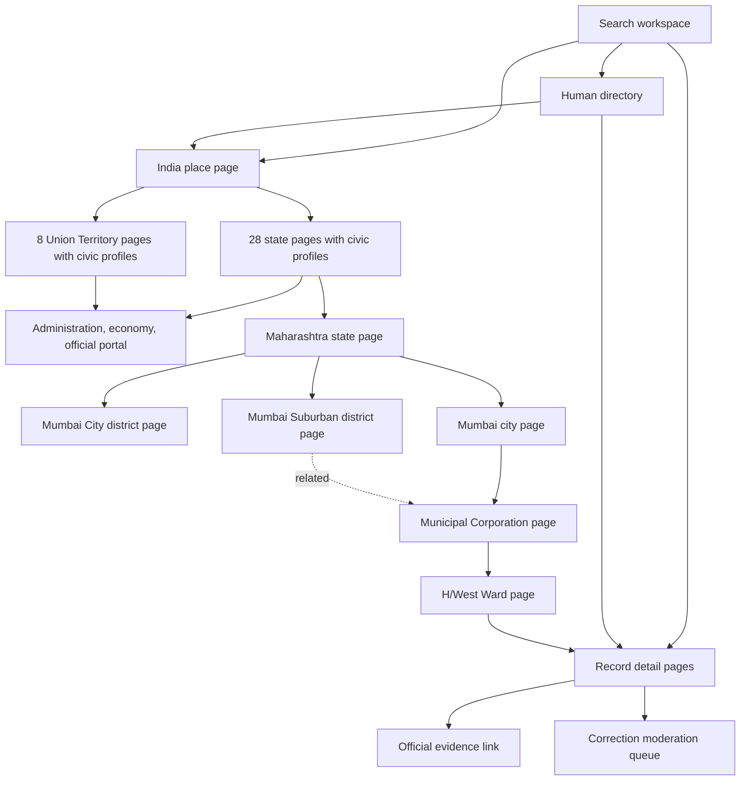

# Site Map

## Public Information Architecture

## Routes

- `/` - search, map, evidence, language switch, and selected-record correction form
- `/directory` - human-readable index of every place and record
- `/records/[id]` - first-party detail page for every normalized record
- `/places/[...slug]` - country, state/UT profile, district, local-government, ward, and locality detail pages
- `/api/search` - typed search response
- `/api/sources` - source catalog and health
- `/api/ingestion` - deterministic ingestion report
- `/api/feedback` - validated correction intake
- `/manifest.webmanifest` - PWA metadata
- `/sitemap.xml` - machine-readable public route map

## Expansion Rule

Add a place to `src/data/geography.ts`, choose its administrative, rural, or urban governance branch, assign source-backed record ids, and keep parent/relationship/slug integrity covered by `tests/navigation.test.ts`. Every new state/UT entry must also have a `StateProfile` in `src/data/state-profiles.ts`. Live LGD/database-backed geography should preserve these route contracts.
